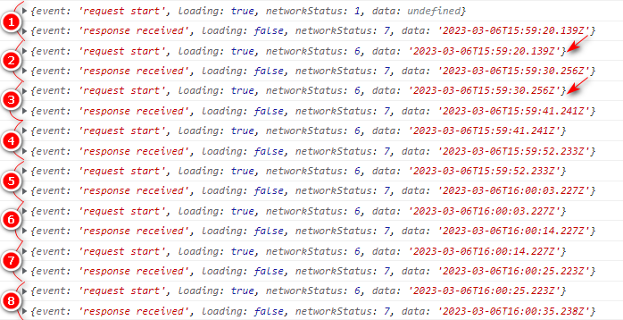

# GraphQL drafts

**Apollo Client**
 + [Pure Query](#1)
 + [Pure Subscription](#2)
 + [Typed Subscription](#3)
 + [Ping Mutation](#4)
 + [Double Next in Long Polling](#5)

## <a name="1"></a> Pure Query
```ts
import { Component } from '@angular/core';
import { Apollo, gql } from 'apollo-angular';
import { Subscription } from 'rxjs';

@Component({
  selector: 'app-root',
  templateUrl: './app.component.html',
  styleUrls: ['./app.component.less'],
})
export class AppComponent {
  sub?: Subscription;

  constructor(private apollo: Apollo) {
  }

  getAuditEvents() {
    this.sub = this.apollo
    .query({
      query: gql`query {
        auditEvents {
          id
          url
        }
      }`
    })
    .subscribe({
      next: (result) => {
        console.log(result.data);
      },
      error: (error) => {
        console.error(error);
      },
      complete: () => {
        console.log({
          'sub closed': this.sub?.closed,
        }); // false
      }
    });
  }
}
```
## <a name="2"></a> Pure Subscription

```ts
import { Component } from '@angular/core';
import { Apollo, gql } from 'apollo-angular';
import { Subscription } from 'rxjs';

@Component({
  selector: 'app-root',
  templateUrl: './app.component.html',
  styleUrls: ['./app.component.less'],
})
export class AppComponent {
  sub?: Subscription;

  constructor(private apollo: Apollo) {
  }

  openWS() {
    this.sub = this.apollo
    .subscribe({
      query: gql`subscription {
        serverMessageReceived {
          messageType
          text
        }
      }`,
    })
    .subscribe({
      next: (result) => {
        console.log(result.data);
      },
      error: (error) => {
        console.error(error);
      },
      complete: () => {
        console.log({
          'sub closed': this.sub?.closed,
        }); // false
      }
    });
  }
}
```
## <a name="3"></a> Typed Subscription
```ts
import { Component, OnInit } from '@angular/core';
import { Apollo } from 'apollo-angular';
import { ServerMessageReceivedGQL } from '../graphql/generated/graphql';

@Component({
  selector: 'app-root',
  templateUrl: './app.component.html',
  styleUrls: ['./app.component.less'],
})
export class AppComponent implements OnInit {
  constructor(
    private apollo: Apollo,
    private serverMessageReceivedGQL: ServerMessageReceivedGQL
  ) {
  }

  ngOnInit(): void {
    this.serverMessageReceivedGQL.subscribe()
      .subscribe(({ data }) => {
        console.log(data?.serverMessageReceived);
      });
  }
}

```
## <a name="4"></a> Ping Mutation
```ts
import { Injectable } from '@angular/core';
import { ApolloError } from '@apollo/client';
import { Store } from '@ngrx/store';
import { filter, interval, takeUntil, tap, throwError } from 'rxjs';
import { PingGQL } from '../../../../graphql/generated/graphql';
import { ServerStatusModel } from '../models/server-status.model';

@Injectable()
export class PingServerService {
  constructor(
    private readonly pingGQL: PingGQL,
    private readonly store: Store<{ serverStatus: ServerStatusModel }>) {
  }

  ping() {
    interval(1000)
      .pipe(
        takeUntil(this.store.select(s => s.serverStatus).pipe(
          filter((serverStatus) => serverStatus !== ServerStatusModel.ping),
        )),
        tap(() => this.pingGQL.mutate()
          .subscribe({
            error: (e) => throwError(() => new Error(e)),
          }),
        ),
      )
      .subscribe({
        error: (e: ApolloError) => console.error(e),
      });
  }
}

```
## <a name="5"></a> Double Next in Long Polling
`next[i] event` -> `{request event, response event}`

`useInitialLoading: true` - `i == 0`

`notifyOnNetworkStatusChange: true` - `i > 0`

```ts
@Injectable()
export class GetHttpPongService {
  readonly valueChanges;

  constructor(
    private readonly getHttpPongGQL: GetHttpPongGQL,
    private readonly store: Store,
  ) {
    this.valueChanges = getHttpPongGQL.watch({}, {
      pollInterval: environment.serverConnection.attemptIntervalSeconds * 1000,
      fetchPolicy: 'network-only',
      useInitialLoading: true,
      notifyOnNetworkStatusChange: true,
    }).valueChanges;
  }

  ping() {
    this.valueChanges
      .pipe(
        tap(({ data, loading, networkStatus }) => {
          console.log({
            event: loading ? 'request start' : 'response received',
            loading,
            networkStatus,
            data: data?.ping?.utcDatetime,
          });
        })
      )
      .subscribe();
  }
}
```

